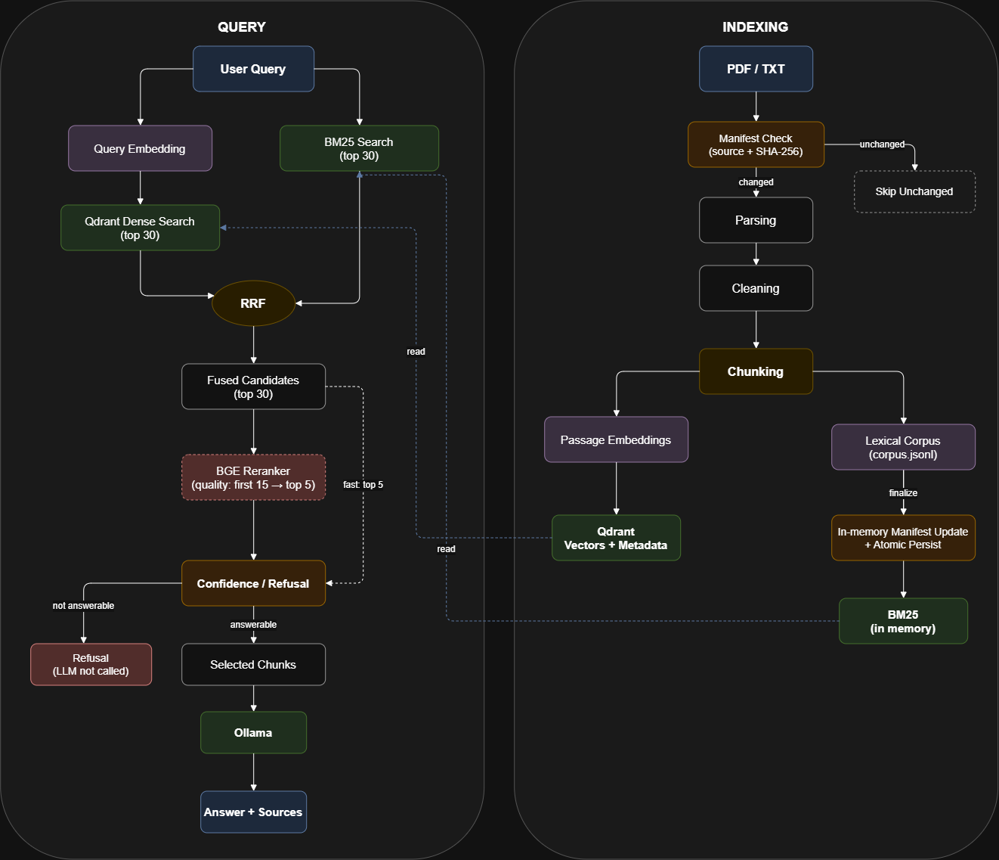

# Document RAG

Локальный RAG для PDF и TXT без LangChain. Индексация, гибридный retrieval, reranking, отказ при низкой уверенности и генерация через Ollama реализованы отдельными компонентами. Desktop RAG Lab и experiment runner используются для изолированных экспериментов и benchmark-запусков.

## Pipeline

## Индексация

1. Входной путь рекурсивно сканируется на `.pdf` и `.txt`. PDF разбирается постранично через PyMuPDF без OCR; TXT читается как UTF-8/UTF-8-SIG или CP1251.
2. Текст нормализуется в NFC, горизонтальные пробелы и переводы строк приводятся к единому виду.
3. Chunking сначала сохраняет границы абзацев, затем предложений; для длинных фрагментов используется разбиение по символам. Между соседними chunks добавляется overlap.
4. Для chunks строятся нормализованные passage embeddings. У E5-моделей к тексту добавляется префикс `passage:`.
5. Векторы и metadata chunks записываются в Qdrant. JSONL-корпус для lexical retrieval обновляется отдельно; после индексации из него в памяти перестраивается BM25.
6. Manifest сопоставляет нормализованный source с SHA-256 файла и `document_id`, поэтому неизменившиеся документы пропускаются, а предыдущие версии заменяются.

Документы обрабатываются пакетами. `record()` обновляет manifest в памяти и не сериализует весь JSON после каждого документа; во время длинного запуска выполняются периодические checkpoints, затем обязательный финальный `persist(force=True)`. Manifest пишется во временный файл и заменяется атомарно; lexical corpus также собирается через временный файл и финальную замену.

## Retrieval

Для каждого запроса выполняется следующий pipeline:

1. Строится query embedding; для E5 используется префикс `query:`.
2. Qdrant возвращает dense ranking по cosine similarity.
3. In-memory BM25 возвращает lexical ranking по тому же корпусу chunks.
4. Reciprocal Rank Fusion объединяет позиции в dense- и BM25-ranking, не сравнивая их raw scores напрямую.
5. Из fused ranking выбираются кандидаты.
6. В режиме `quality` кандидаты проходят reranker; в `fast` этот шаг пропускается.
7. По верхнему результату принимается решение confidence/refusal.
8. После положительного решения выбирается финальный контекст.
9. Ollama генерирует ответ только по запросу и выбранным chunks.

## Reranker

Текущая baseline-модель — `BAAI/bge-reranker-v2-m3`. Она оценивает пары `(query, chunk)` для первых 15 результатов после RRF и возвращает до 5 chunks. Reranker опционален: `fast` отключает его, `quality` включает; при создании retriever без явно заданного режима используется `ENABLE_RERANKER`.

## Confidence / refusal

Решение строится по верхнему результату. Всегда проверяется dense score; если тот же chunk найден и dense-, и BM25-поиском, используется отдельный порог для hybrid agreement. При включённом reranker дополнительно проверяется его score.

Если retrieval недостаточно уверен, запрос отклоняется до вызова LLM: `is_answerable=False`, список sources пуст, `generation_ms=0`, контекст в Ollama не отправляется.

## Generation

Baseline-модель Ollama — `qwen3:4b-instruct`, temperature — `0`. В prompt передаются query и только выбранные chunks, ограниченные `FINAL_TOP_K` и `MAX_CONTEXT_CHUNKS`, а не весь corpus.

Query API и desktop GUI возвращают ответ, `is_answerable`, timings и sources. Для каждого source доступны filename, page, `chunk_id`, итоговый retrieval score и, если применимо, dense, BM25, RRF и reranker scores.

## Experiments

RAG Lab по умолчанию строит isolated index в `data/experiments/<experiment-id>/index`; baseline index изменяется только после явного подтверждения. Изолированный index получает отдельные пути к Qdrant, lexical corpus и manifest, а также отдельную Qdrant collection. Benchmark artifacts такого запуска сохраняются внутри каталога эксперимента.

Experiment fingerprint — первые восемь символов SHA-256 сериализованного `ExperimentConfig`. В него входят `name`, путь к corpus, `index_config`, `query_config`, путь к evaluation set, `mode`, список `queries` и `force_reindex`. Изменение `chunk_size`, `chunk_overlap`, `embedding_model` или `embedding_batch_size` требует нового индекса; experiment только с query-time параметрами использует существующий baseline index.

Действие `Activate Existing Index` вычисляет тот же experiment path/collection по выбранным corpus и параметрам, проверяет наличие Qdrant, lexical corpus и manifest и подключает их без повторной индексации.

## Benchmarking

Indexing summary содержит следующие timings в секундах:

- `parsing_seconds`, `cleaning_seconds`, `chunking_seconds`;
- `embedding_model_loading_seconds`, `embedding_seconds`;
- `qdrant_initialization_seconds`, `qdrant_upsert_seconds`;
- `lexical_corpus_seconds`, `bm25_build_seconds`;
- `manifest_handling_seconds`, `manifest_serialization_seconds`, `manifest_write_seconds`, `manifest_atomic_replace_seconds`;
- `runtime_initialization_seconds`, `indexing_seconds`, `total_seconds`.

Также сохраняются `manifest_persist_count`, discovery, объём обработанных данных, число файлов, страниц, chunks и embedding batches, throughput и финальный размер индекса. `resources.csv` содержит временной ряд по стадиям: CPU процесса и системы, RSS процесса и использованную RAM системы, disk read/write totals и rates, свободное место, размер каталога индекса, GPU utilization, VRAM, temperature и power. GPU-поля заполняются через `nvidia-smi`, если он доступен.

Для запросов в `queries.jsonl` и `run.json` сохраняются `base_retrieval_ms`, `reranker_ms`, `retrieval_total_ms`, `generation_ms` и `total_ms`; отдельно фиксируется wall time, включая инициализацию runtime первого запроса. Каждый benchmark-каталог также содержит snapshot конфигурации и окружения, `stages.csv` и сведения о corpus fingerprint и состоянии Git.

## Baseline configuration

| Параметр |                         Значение |
|---|---------------------------------:|
| Chunk size |                  `1000` символов |
| Overlap |                   `150` символов |
| Embedding model | `intfloat/multilingual-e5-small` |
| Embedding dimension |                            `384` |
| Embedding batch size |                             `32` |
| Document batch size |                             `16` |
| Dense top K |                             `30` |
| BM25 top K |                             `30` |
| Fusion top K |                             `30` |
| RRF k |                             `60` |
| Reranker model |        `BAAI/bge-reranker-v2-m3` |
| Rerank candidates |                             `15` |
| Final top K |                              `5` |
| Ollama model |              `qwen3:4b-instruct` |
| Temperature |                              `0` |

## Repository data

Corpus, Qdrant indexes, lexical corpus, manifests, model weights/caches и runtime benchmark/experiment data не коммитятся. В `data/` отслеживается только небольшой evaluation set `data/eval/retrieval_eval.json`.
